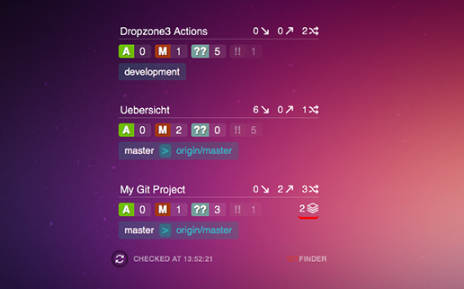

Übersicht | GitFinder Widget
=================
:closed_book: [Übersicht Homepage](http://tracesof.net/uebersicht/)
&nbsp;&nbsp;&nbsp;:pushpin: [Übersicht Widgets](http://tracesof.net/uebersicht-widgets/)
&nbsp;&nbsp;&nbsp;:page_facing_up: [Widgets GitHub Repo](https://github.com/felixhageloh/uebersicht-widgets)

Display your Git projects on your macOS desktop with Übersicht.

Open projects versioned with Git with the **Finder** or **Xcode** and GitFinder displays statistics of them.

It looks for current branches, remote branches, total branches, files added, modified, untracked and ignored, and projects ahead, behind state.

The program also check if project has been modified to apply modification and add the new git project to the list with a nice animation.

Additionally, you add **additional Git project paths** in the **Config file**.

- **Finder:** Scans for visible windows containing a folder versioned with Git
- **XCode:** Open the active XCode Project




## Installation

Put the widget into the __Übersicht Widget folder__ and the folder which contains __the NodeJS script elsewhere__.

I have a folder for the __Übersicht widget__, and a folder for the __Command Scripts__ like this:

<p>
:open_file_folder: <b>Ubersicht</b><br>
&nbsp;&nbsp;&nbsp;&nbsp;&nbsp;&nbsp;&nbsp;&nbsp;:file_folder: Widgets<br>
&nbsp;&nbsp;&nbsp;&nbsp;&nbsp;&nbsp;&nbsp;&nbsp;:file_folder: Command<br>
</p>

## Change command path
Change the __absolute path of the command__ in the widget script.
```
command: "/usr/local/bin/node /full/path/to/the/Command/GitFinder.command/GitFinder.js"
```

## Download Latest
[GitHub > Ubersicht-GitFinder > Latest Release](https://github.com/atika/Ubersicht-GitFinder/releases/latest)

## config.json
Edit the __config.json__ located in the command folder to personalise the widget.

```
{
    "additionals_paths": [],
    "prefs": {
        "backStyle": {
            "background-color": "rgba(0,0,0,0.3)",
            "border": "solid 1px rgba(255,255,255,0.1)",
            "color": "white"
        },
        "applyBackStyle": false,
        "showMark": true,
        "showSize": true,
        "position": "TL|20|20",
        "statsAfter": false,
        "statsBigger": false,
        "showIgnored": true,
        "autoFade": false,
        "autoFadeTimeout":8000
    }
}
```

* __additionals_paths:__ Absolute paths list of static Git Projects
* __backStyle:__ Change the background appearence
* __applyBackStyle:__ Apply the custom style
* __showMark:__ Show the name at bottom left
* __showSize:__ Show the project folder size
* __position__:
    - Top Left:  ```TL|left_margin|top_margin```
    - Top Right: ```TR|right_margin|top_margin```
    - Bottom Left: ```BL|left_margin|bottom_margin```
    - Bottom Right: ```BR|right_margin|bottom_margin```
    - Center on screen: ```C|0|0```
* __statsAfter:__ If true display the stats after the branch
* __statsBigger:__ Bigger font for stats
* __showIgnored:__ Display/Hide ignored files counter
* __autoFade:__ Auto fade widget on inactivity
* __autoFadeTimeout:__ Auto fade timeout

## Versions
* __v0.4__
    - Remove duplicates projects
    - Open active XCode Project
* __v0.3__
    - Time format
    - Enhance stop function
* __v0.2__
    - Display Project Size (config: `` showSize: true ``)
    - Large projects name are displayed correctly
    - Minimized windows in the dock are also displayed
